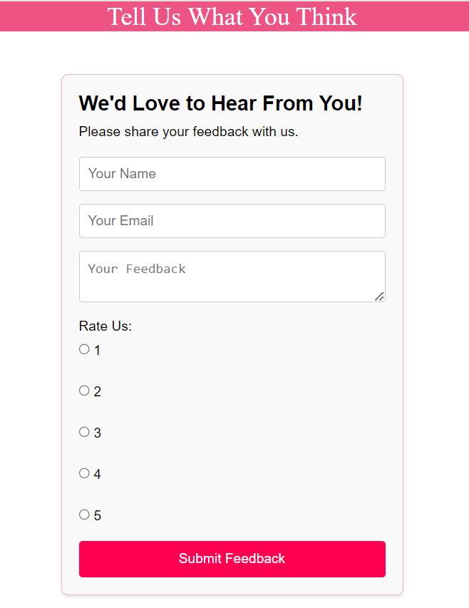

# Feedback Form App

## Overview
The **Feedback Form App** is a simple and interactive application built using React. It allows users to submit their feedback by entering their name, email, and a feedback message. This project demonstrates key React concepts such as functional components, state management with the `useState` hook, form validation, and handling user interactions. The app also includes user-friendly features like a confirmation dialog and a thank-you message upon successful submission.

## Features
- **User Feedback Form**: A clean and responsive form to collect user details, including:
  - Name
  - Email
  - Feedback message
- **Input Validation**: Ensures that users provide both their name and feedback before allowing submission.
- **Confirmation Dialog**: Displays a summary of the entered details and prompts users to confirm their submission.
- **Form Reset**: Clears all input fields after a successful submission.
- **Thank-You Message**: Displays a confirmation message to the user after their feedback is submitted.

## Implementation Details
1. **React Functional Components**:
   - The app is built using functional components for better modularity and reusability.
2. **State Management**:
   - The `useState` hook is used to manage form inputs and user details dynamically.
3. **Event Handlers**:
   - Implemented for handling input changes, form submissions, and confirmation dialog interactions.
4. **Validation**:
   - Basic input validation is included to ensure required fields are filled before submission.
5. **User Experience**:
   - A confirmation dialog (using `confirm` method) allows users to verify their details before final submission.
   - The form is reset after a successful submission, providing a clean state for further feedback.

## How It Works
1. The user fills out their details in the feedback form.
2. Upon clicking the submit button:
   - Input validation ensures all required fields are completed.
   - A confirmation dialog is displayed with the entered details.
3. If the user confirms the submission:
   - The details are processed.
   - The form fields are cleared.
   - A thank-you message is displayed.
4. The form is ready for new feedback submissions.

## Screenshots
#### Form

#### Output

#### Alert


## Learning Objectives
This project helped me practice and demonstrate:
- Building forms using React functional components.
- Managing state with the `useState` hook.
- Implementing form validation and event handling.
- Creating confirmation dialogs for user interactions.
- Enhancing user experience with dynamic form reset and feedback.

## Getting Started
To run the app locally:
1. Clone the repository.
2. Navigate to the project directory.
3. Install dependencies:
   ```bash
   npm install
    ```
4. Start the development server:
    ```bash
    npm start
    ```
5. Open http://localhost:3000 in your browser to view the app.